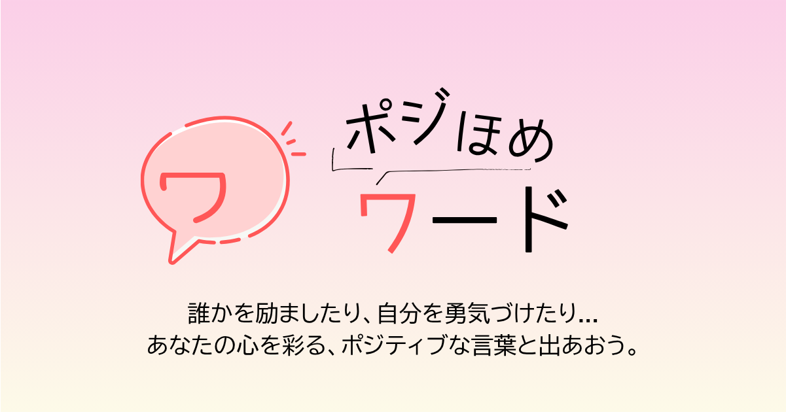

# 🌸『ポジほめワード』
サービスURL：[ポジほめワード](https://pojihomeword.com/)  
<br>
<br>

# 📚目次
- [サービス概要](#-サービス概要)
- [サービス開発の背景](#サービス開発の背景)
- [ユーザー層について](#-ユーザー層について)
- [推しポイント](#-推しポイント)
- [機能紹介](#-機能紹介)
- [メイン機能紹介](#-メイン機能紹介)
- [今後の展望](#-今後の展望)
- [技術構成について](#-技術構成について)
  - [使用技術](#使用技術)
  - [ER図](#er図)
  - [画面遷移図](#画面遷移図)<br>
<br>

# 🔎 サービス概要
ポジほめワードは「ほめる・肯定する」コミュニケーションをサポートするアプリです。<br>
ポジティブな言葉を、ユーザーが選択したシチュエーションに合わせてランダムに表示します。自己肯定感を高め、日常生活や職場で、より良い人間関係を築く力を育むお手伝いをします。<br>
<br>

# ❓サービス開発の背景
私は人見知りで口下手なため、なかなか人間関係がスムーズに築けませんでした。<br>
<br>

そんな中で、ポジティブな言葉が相手に心地よい印象を与え、関係を深める力を持っていることに気づきました。実際、ポジティブな言葉で支えられ、自己肯定感が高まり、人間関係も改善された経験があります。<br>
<br>

このアプリを通じて、日常的に使える「ほめる・肯定する」言葉をサポートし、より良いコミュニケーションを促進し、自己肯定感を高め、ポジティブな社会作りに貢献したいと考えています。<br>
<br>

# 👩 ユーザー層について
- **人間関係をスムーズに築きたいと感じている人**  
  人間関係に悩む多くの人が、コミュニケーションの改善を望んでいるため。ポジティブな言葉を使うことで、相手との信頼を築きやすくなります。  
-  **自己肯定感を高めたいと感じている人**  
  自己肯定感が低いと、他者との関係がうまくいかず、自己表現にも制限がかかります。ポジティブな言葉を学んでいくことで、前向きな変化を促します。
<br>

# 🎵 推しポイント 
- **メッセージ提案機能**: ユーザーが何を言ったら良いか迷う場面でも、シチュエーションに合ったほめ言葉やポジティブな言葉を即座に提案。  
- **自己肯定感の向上**: ユーザーがほめ言葉やポジティブな言葉を習慣化し、前向きな行動をサポートします。  
- **ポジティブワードの蓄積**: お気に入り機能でほめ言葉やポジティブな言葉を蓄積し、自己肯定感の向上につなげる。
<br>  

# 💻 機能紹介

| 🙍ユーザー登録 / ログイン |
| :---: | 
|    |
| <p align="left">gem deviseを使用。『名前』『メールアドレス』『パスワード』『確認用パスワード』を入力してユーザー登録を行います。ユーザー登録後は、自動的にログイン処理が行われるようになっており、そのまま直ぐにサービスを利用する事が出来ます。また、Google・LINEと連携しているため、Googleアカウント、LINEアカウントでログインを行う事も可能です。</p> |
<br>

| 💡 ポジティブワードを知る / ポジティブなワードを生成 |
| :---: | 
|  |
| <p align="left">「誰に」「どんな」言葉を送りたい？ ユーザーが入力したシチュエーションに合わせて、 AIがポジティブなワードを作成します。ワードはX、LINEで共有可能です。</p> |
<br>

| 📒 ポジティブワードをためる / ポジティブなワードを保存・追加する  |
| :---: | 
|  |
| <p align="left">AIが生成したワードは、お気に入り登録することでユーザーページに保存されます。 また、日常生活で見つけた素敵な言葉を自分で入力し、「カスタムワード」として追加・保存・X、LINEで共有することも可能です。ポジティブワードは、総合のワードカウント数、AIが生成した「お気に入りワード」の数、自分で作った「カスタムワード」の数の3種類で表示されます。 ワードが増えるのを見て、達成感を感じてもらえます。</p> |
<br>

| 📤 ポジティブワードを共有する / ポジティブなワードを保存・追加する |
| :---: | 
| |
| <p align="left">自分のワードを投稿することはもちろん、他のユーザーが投稿したワードを見ることができます。どんなポジティブなワードを、どのようなシーンで送ったのかが投稿されているため、語彙力も広がりまた一つポジティブなワードを知る機会となります。<p> |
<br>

| ⭐ ポジティブワードを共有する / 投稿のコメント機能・お気に入り登録 |
| :---: | 
| |
| <p align="left">共感するワードなどがあれば詳細ページでぜひコメントしよう。またワードをX、LINEで共有してさらにポジティブな輪を広げよう。いいなと思う投稿があればお気に入り登録が可能。「★お気に入り」ではお気に入り登録された投稿を確認できます。<p> |
<br>

# ⚙ メイン機能紹介
## 💡 ポジティブワードを知る / ポジティブなワードを生成

- **処理ファイル**：
  - `app/controllers/ai_messages_controller.rb`
  - `app/services/ai_messages_generator.rb`
  - `app/models/positive_word.rb`
  - `app/views/ai_messages/new.html.erb`
  - `app/views/ai_messages/_form.html.erb`
  - `app/views/ai_messages/_result.html.erb`
  - `app/javascript/situations.js`
<br>

- **処理の流れ**：
 

  1. ユーザーが「誰に」「どんな時」の入力フォームに情報を入力し送信
  2. コントローラの `generate` アクションで `Target` と `Situation` を検索または作成
  3. `AiMessagesGenerator.call` にて OpenAI GPT-4.1-mini を呼び出し、対象と状況に合ったポジティブワードを生成
  4. 生成したワードを `current_user.positive_words` としてDBに保存
  5. 生成ワードを画面に表示
  6. フロントで紙吹雪アニメーションを表示し、ユーザー体験を向上
  7. 生成済みワードの編集、コピー、いいね機能も提供
<br>

- **技術選定理由**：
  - OpenAI API（GPT-4.1-mini）による自然な日本語ポジティブメッセージ生成を実現。temperature: 0.9で固くならずに親しみやすいカジュアルな文章を生成  
  - サービスオブジェクトパターン（`AiMessagesGenerator`）でロジックを分離し保守性を確保  
実装コード（`app/services/ai_messages_generator.rb`）：
```ruby
class AiMessagesGenerator
  def self.call(target_name:, situation_name:)
    prompt = "#{target_name}が#{situation_name}ときに贈る、ほめたり、肯定したりなどポジティブになれる会話文のような短いメッセージまたはワードを1つ考えてください。出力はそのメッセージ、またはワードの本文のみを日本語で返してください。親しみやすいカジュアルな口調で書いてください。マジではいらないです。番号付け、複数回答、説明や挨拶などは不要です。過去に生成されたメッセージ・ワードと重複しないようにしてください。"

    client = OpenAI::Client.new
    response = client.chat(
      parameters: {
        model: "gpt-4.1-mini",
        messages: [ { role: "user", content: prompt } ],
        temperature: 0.9
      }
    )

    response.dig("choices", 0, "message", "content")
  end
end
```
  - JavaScriptで紙吹雪演出やローディングアニメーションを実装しUX向上  
  - SEO・SNSシェア向けにOGP画像生成・メタタグ設定を行い拡散を促進  
<br>

# 🔄 今後の展望
- **ポジティブワード生成結果の演出向上**: 生成結果をフラッシュメッセージのように出すなど、もっと動的に演出し、UI/UXからもポジティブな気持ちになるように展開。  
- **既存のワードをポジティブワード化**: シチュエーションに合わせるだけでなく、既存のワードをポジティブ化することで語彙力を高めてもらえます。  
- **投稿ワードの人気順**: お気に入り登録されているワードのカウント数の多いものから並べなれるようにし、よりポジティブなワードを使う機会の参考にしてもらいます。  
<br>

# 🔧 技術構成について

## 使用技術

| カテゴリ | 技術内容 | 理由・特徴 |
|----------|----------|------------|
| サーバーサイド | Ruby on Rails 8.0.2 / Ruby 3.2.2 | RailsはCRUD・認証・投稿などを高速・堅牢に構築でき、 Rails8ならHotwireが標準搭載されているためUX向上も実現。Ruby 3.2.2はYJITにより高速化され、現場でもよく使われる安定バージョン。 |
| フロントエンド | Turbo / Stimulus / Importmap | TurboはJavaScriptなしでページ遷移を高速化、StimulusはHTMLにデータ属性を追加することで、JavaScriptの振る舞いを直感的に制御が可能で保守性が高い。ImportmapによりWebpackやNode.js不要で構成がシンプルになる。 |
| CSSフレームワーク | Tailwind CSS 3.4.17 | クラスベースで直感的にスタイルが指定でき、保守性・開発効率が高い。Rails 8との相性も非常に良い。 |
| Web API | OpenAI GPT-4.1-mini / Google API / LINE Developers | GPT-4.1-miniは応答速度とコストのバランスが良く、短文生成に最適。GoogleはOAuth認証、LINEは通知連携を想定。 |
| データベース | PostgreSQL 15（Docker） | 安定性・拡張性・トランザクション処理に強く、本番に近い動作検証が可能。Dockerにより環境構築の再現性も確保。 |
| インフラ / デプロイ | Render | GitHubと連携しCI/CDが自動化可能。無料プランあり、個人開発に適している。独自ドメインやSSLも簡単に設定可能。 |
| バージョン管理 / CI | GitHub / GitHub Actions | バージョン管理、レビュー、CI/CDパイプラインの自動化が可能。品質向上と効率化に貢献。 |
<br>

## 画面遷移図  
Figma:(https://www.figma.com/design/CJPRX5SV3sib60vnQLbSkx/%E5%8D%92%E6%A5%AD%E5%88%B6%E4%BD%9C_%E7%94%BB%E9%9D%A2%E9%81%B7%E7%A7%BB%E5%9B%B3?node-id=0-1&t=CmzqvyAh9Eg195yV-1)

## ER図  
ER図:(https://drive.google.com/file/d/1YiQ3WmCqxhXwAbfQ9fWhJTs98NzYgVWr/view?usp=sharing)
